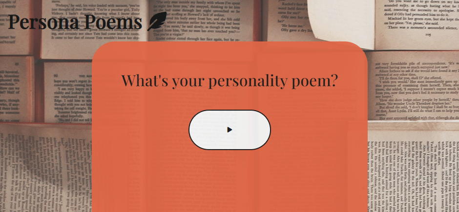
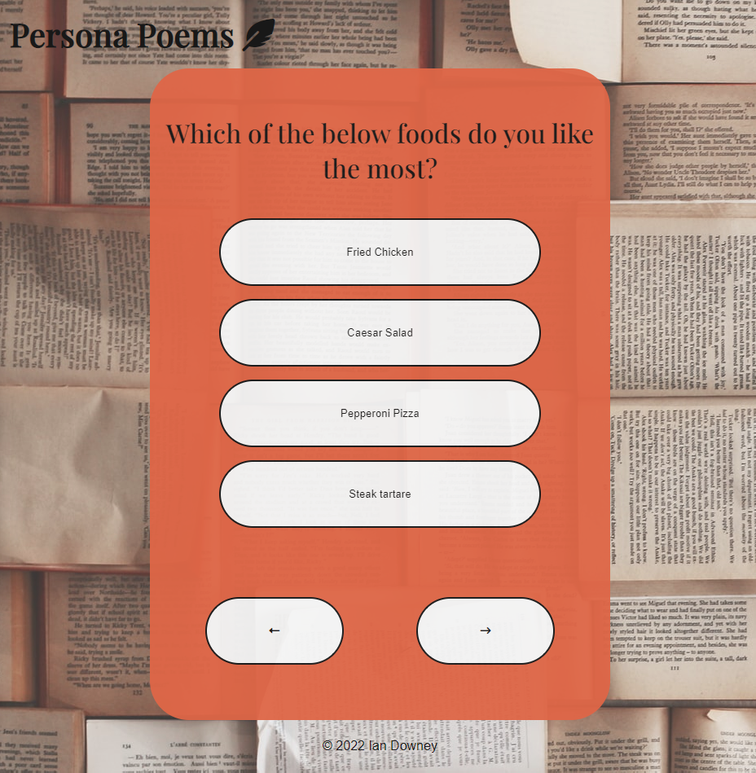
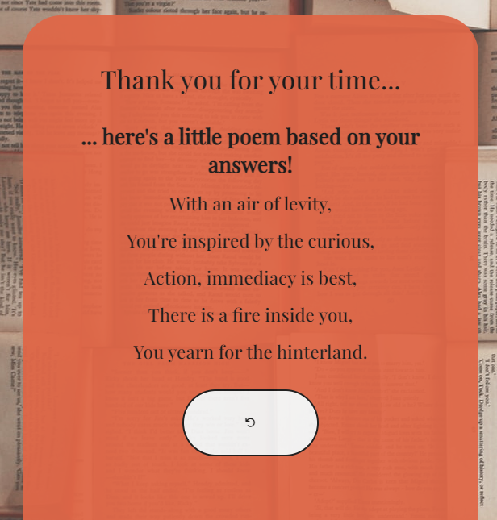

# Persona Poems
A vibrant, simple site designed to provide a short personality poem based on the user's answers. 

The site was intended to have a warm welcome and simple structure. I did not want to overwhelm the site with unnecessary features as the main obective is to deliver a short piece of writing to entertain the user. 

[Live project available here](http://ian-downey.xyz/persona-poems)

# Features
## Existing Features
 
 - Favicon
 - Single page (simplicity)
 - Responsivity - site responds to M + L Phone, tablet, laptop and computer
 - Clickable Trademark hyperlinking to email
 - Header & Start button - a header in the top left corner to display the name of the site, and a start button to prompt the user to begin the set of questions.

- Navigation and Restart buttons - there is a left and right navigation button below list of answers that will help users navigate the questions, allowing them to select different answers to previously asked questions. Restart button is presented at the end below the poem to allow the user to start again!

## Future Features
 - Have questions with less/more than 4 answers
 - Improve the fluidity of the rhyming! :-)
 - Have a default line for unanswered questions

# Testing

For validating my code I used:

- W3C Markup Validator
  - No errors were returned when passed through
- W3C CSS Validator
  - No errors were returned when passed through
- JSHint
  - No errors were returned when passed through

Tested project on web.dev, receiving the following scores:

- Performance: 72 
- Accesibility: 81
- Best Practices: 92 
- SEO: 91

# Bugs, Problems

Throughout my project, I encountered many problems and bugs, especially when coding the JavaScript section. This was the most difficult section, as multiple times I needed to rework how the logic of the poem worked.

I tried to document these issues as much as possible, as my github will show. I did run into timing issues this month after contracting Covid, so there is far more that I would have liked to achieve. Still, I'm happy with what I accomplished.

One of my major issues was the logic of the poem and how the sentences were pulled out after an answer was given. Initially, I wanted to have 10 questions varying a different of options, though time did work against me and I was unable to accomplish this. I had trouble deciding whether the answers would be stored in a separate array to the questions, but ultimately I decided it easier to have the question, answer and corresponding poetic sentence stored together in one array. Although I am happy with how the concept turned out in the end and it is certainly one I will expound! Having said that, there are bugs that need to be addressed: 

- User can skip question, leaving 'undefined' as answer in final poem. This can be fixed by removing the right navigation or having a default answer for each question.
- Left navigation doesn't do anything on the first question. This can be removed or returns the user to the start page. 

# Technology

- Github
- Gitpod
- HTML
- CSS 
- JavaScript
- Google Font
- Unsplash
- Font Awesome
- Icons8
- Markdown

# Deployment
- The site was deployed to GitHub pages. The steps to deploy are as follows:
  - In the GitHub repository, navigate to the Settings tab
  - From the source section drop-down menu, select the Master Branch
  - Once the master branch has been selected, the page provided the link to the completed website

# Acknowledgements

Special thanks to my girlfriend, Grace and my brother, Colin. They gave me invaluable support and guidance through my project yet again, so thank you guys!!

Also, thank you to the fine lecturers of Code Institute, and the ever-growing community on Slack!

I'm delighted to now know what I know about JavaScript. It was a very difficult road from the start of the month as I struggled to get a great bearing on JavaScript, but I'm delighted with how far I've come and relish the next challenge of Python! 
